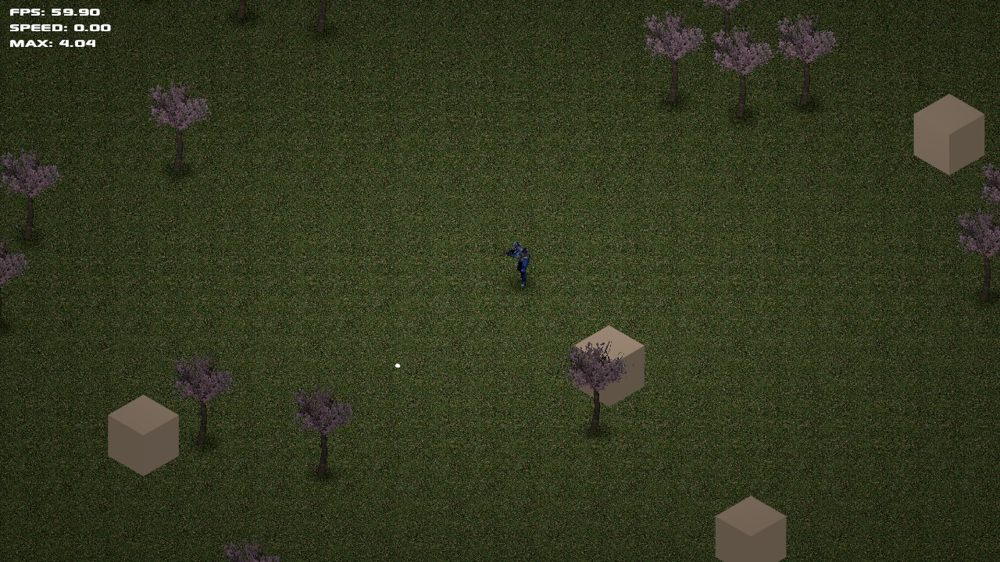

# Isotokyo
Isometric tactical shooter inspired by the Source mod [Neotokyo](https://store.steampowered.com/app/244630/NEOTOKYO/), featuring Quake/Source style movement and point-and-click aiming with screen space recoil.

## Technology
Built on the [Bevy](https://bevyengine.org/) engine with physics powered by [Bevy XPBD](https://github.com/Jondolf/bevy_xpbd).

## Config
A config file will be created in `config/config.ron` when the game is launched for the first time. The settings should be mostly self-explanatory.
